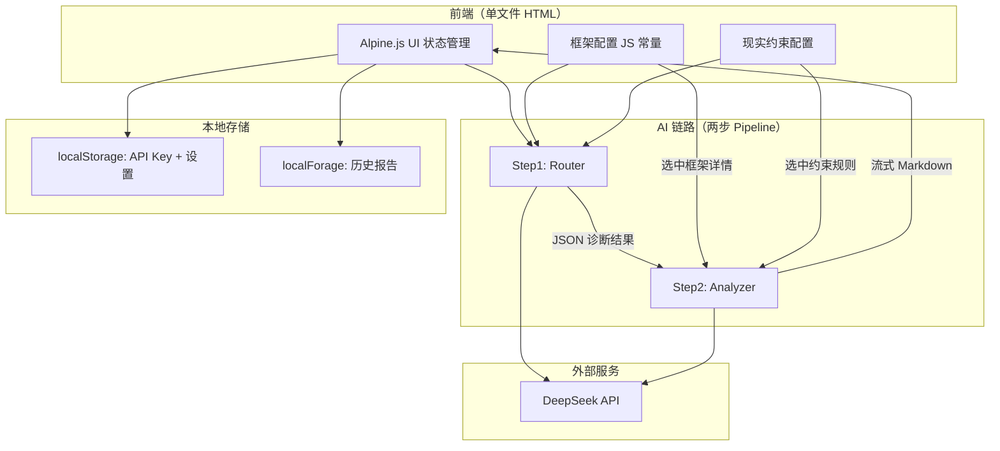

# ThinkBridge — 技术架构文档

## 1. 架构设计



## 2. 技术说明

- **前端**：单文件 HTML + Tailwind CDN + Alpine.js CDN
- **AI**：DeepSeek API（两步 Pipeline：Router JSON + Analyzer Markdown）
- **调用方式**：浏览器 fetch DeepSeek API（若 CORS 不通则加 Cloudflare Worker 代理）
- **流式输出**：fetch stream + getReader() 逐块读取
- **轻量存储**：localStorage（API Key、设置）
- **长文本存储**：localForage / IndexedDB（历史报告）
- **Markdown 渲染**：marked.js CDN
- **PWA**：manifest.json + service worker（M3 实现）
- **运行**：本地浏览器，暂不上线

## 3. 路由定义

本项目为单文件 HTML，使用 Alpine.js 管理页面状态切换，无 URL 路由。

| 状态 | 页面内容 |
|------|----------|
| analyze | 分析页（默认） |
| library | 框架库页 |
| history | 历史页 |
| framework-detail | 框架详情弹窗 |
| history-detail | 历史报告弹窗 |

## 4. 数据模型

### 4.1 框架配置结构

```typescript
interface Framework {
  id: string;
  name: string;
  category: string;
  summary: string;
  solves: string;
  thinking_order: string[];
  teaching_points: string[];
  self_questions: string[];
  common_misuses: string[];
}
```

### 4.2 现实约束配置结构

```typescript
interface RealityFilter {
  id: string;
  name: string;
  trigger_scenarios: string[];
  check_items: string[];
}
```

### 4.3 历史记录结构

```typescript
interface HistoryRecord {
  id: string; // timestamp
  question: string;
  mode: 'learning' | 'quick';
  frameworks: string[];
  answer: string; // 完整 Markdown 报告
  diagnosis: RouterResult;
  createdAt: string;
  feedback: null | 'helpful' | 'not_helpful';
  user_tried_first: boolean;
}
```

### 4.4 Router 输出结构

```typescript
interface RouterResult {
  status: 'ready' | 'need_more_info';
  needs_clarification: boolean;
  clarifying_questions: string[];
  problem_type: string;
  problem_subtype?: string;
  selected_frameworks: string[];
  validation_frameworks: string[];
  reality_filters: string[];
  reason: string;
}
```

## 5. 实现计划

### M1：跑通核心 AI 链路

- **模块 A**：静态骨架（HTML + 框架配置 + 框架库浏览）
- **模块 B**：API 通道验证（CORS 测试）
- **模块 C**：Step 1 Router（JSON 诊断 + 解析兜底 + 信息不足处理）
- **模块 D**：Step 2 Analyzer（流式 Markdown 报告 + 端到端串联）

### M2：数据与流式体验

- 流式文本显示 + Markdown 渲染
- localForage 历史记录 + 历史页
- 复制报告 + 错误处理

### M3：手机端 UI 与 PWA

- Tailwind 移动端布局 + Alpine.js 状态管理
- 模式切换 + manifest + service worker + 离线检测
